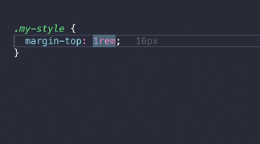

# DNB Eufemia VSCode Extension

This extension will include tools and helpers to enhance DX and make devs more productive during development while using Eufemia as their design system tool.

## Spacing helpers and conversion

When inside files like: CSS, SCSS, Emotion or Styled Components.



### Spacing types

Spacing types are [Eufemia spatial system](https://eufemia.dnb.no/uilib/usage/layout/spacing/) units like; large, medium, small. They can and should be used when defining spacing between components:

```css
div {
  margin-top: var(--spacing-small); /* 1rem (16px) */
  top: calc(
    var(--spacing-medium) + var(--spacing-small)
  ); /* 2.5rem (40px) */
}
```

- Convert `px` values to "spacing types". Effects CSS properties like margin, padding etc.
- When cursor is on line, show "spacing types" `calc` summary in `rem` and pixels.

### Other pixel values

- Convert `px` values to `rem` value.
- When cursor is on line, show `rem` value of pixels.

### font-size and line-height

- Convert `px` and `rem` values to e.g. `var(--font-size-small)`.
- When cursor is on line, show `rem` and `px` value of `var(--font-size-small)`.

```css
span {
  font-size: var(--font-size-basis); /* 1.125rem (18px) */
  line-height: var(--line-height-basis); /* 1.5rem (24px) */
}
```

## Configuration

You can either change the settings inside your VSCode (`eufemia.x`) or in a config file (`.vscode-eufemia.json`) you commit to your repository. The config file can be placed on every relative directory level (mono-repo support). This way, everyone on the team can use the same settings. Above the default options:

```yaml
{
  "rootFontSize": 16,
  "fixedDigits": 4,
  "autoRemovePrefixZero": true,
  "ingoresViaCommand": [],
  "addMark": false,
  "hover": "onlyMark" /* disabled | always | onlyMark */,
  "ingores": [],
  "languages": [
    "css",
    "scss",
    "sass",
    "javascriptreact",
    "typescriptreact",
    "javascript",
    "typescript"
  ],
  "spacingProperties": [
    "margin",
    "padding",
    "top",
    "bottom",
    "left",
    "right",
    "inset"
  ],
  "currentLine": "show" /* disabled | show */,
  "calcMethodName": "calc"
}
```
